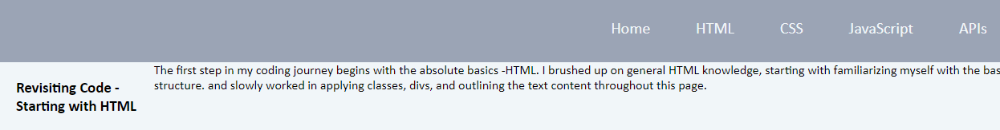
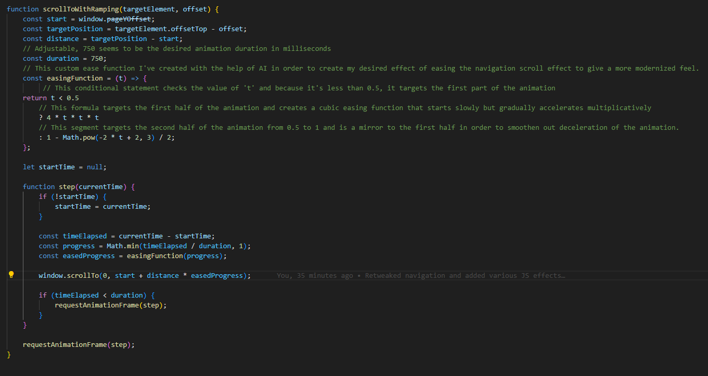

Reforge Journey Journal Entries

This text file marks the beginning of my journey to reacclimate and recommit to my previous passion and desire to undergo a career change in software engineering.

Purpose
The purpose of this project is to re-acclimate my acquired knowledge of coding from the UCLA Extension Bootcamp I enrolled and completed approximately one year ago. Navigating and even taking the first steps to change my career from a self employed photographer to being a software engineer has been very difficult due to the balancing of time allocation and finiancial obligations needed to survive in the modern age. This project will be an exercise in my commitment to reforge my coding skills so that I have the necessary tools to undergo my goal of becoming a professional software engineer. These Journal entries will be written informally as a way for me to organize my thoughts and allow others/potential future employers to explore my way of thinking and/or problem solving skills.

10/6/23 -2 AM

I will start off with committing this markdown file to my github and continue onward to create a webpage that will further organize and outline my journey to come.

Realizations - Need to reacclimate myself into getting into the flow of day-to-day coding again, including using git and github, creating commits, branches, etc.

I started with creating a repository with this journal entry file, a basic README, and the MIT license.

I think I should create a basic HTML and CSS file to start this project. I must also remember how to organize my respositories, and for that I'm going to revisit some of my earlier projects from my coding bootcamp. It seems like I used to have an assets folder that had CSS, JS, and other necessary subfolders so I'll apply that to my repository and create my boilerplate within. 

Alongside this boilerplate creation, I'll also use this as an opportunity to practice my branch creation and pull request/review habits. 

I should now look at my previous repos and see how I created boilerplate HTML and CSS files. Unsure If I want to incorporate javascript to this project just yet.

Finished going down a rabbit hole of reading articles and cross referencing my old work. I've re-familiarized the basics of repo structuring and also did a lot of research on industry standards. I've also re-opened the conversation of AI existing in today's software engineering case and have come to a few realizations. AI going forward may be an invaluable tool for efficiency. During my coding break, I've felt very nervous about how competent AI has become, especially in the software engineering world, but now have come to the realization that AI can also be a very useful tool for those that know how to integrate it to increase personal capabilities and efficiency in work. I should look to incorporate using AI more often in re-learning and also utilizing it for efficiency in my day-to-day work going forward. For now, I've added the boilerplate HTML file to the repo and will continue my journey tomorrow.

10/6/23 -11:40 PM

Tonight will be a short session but I really wanted to get my general idea outlined.

General Concept: Have a space where I can practice and display general concepts and practices. If not directly on this repo, I will include links to extraneous applications.

I'll retrace my steps in my bootcamp curriculum and create goals/segments to practice what I've previously learned. General objectives are as follows: 

HTML
CSS
JavaScript
APIs
Object Oriented Programming

For now I'll limit to those objectives as they are more front-end focused and ending with a refresher on object oriented programming will be a good segway to back-end application.

With just a little bit of an online refresher, a lot of HTML is coming back to me, and I remember that a lof of front end work came very natural to me. I managed to make a navbar pretty quickly and will look to create body content and link from navbar. Will not go for too much longer, but it's been a great refresher into some of the basic front end stuff!

Final few steps of the night result in the following, fixing the missing # symbols from above image and getting the base structure of the project underway.

Upon finishing my quick session for the night, I remember that my instructors also taught me about scrum meetings in the work environment. I'll also do my best to incorporate a short personal version of that for my sessions going into the future.

What I've Accomplished: 
Have refreshed basics of HTML and setup for CSS and javaScript.

What am I working on the next session: CSS styling, and HTML content for project goals/ideas.

10/10/23 - 8:20 PM

Gone for the weekend for a wedding but more inspired for this project than ever! Today's goal will be to see how far I can get with tinkering with my journey page. Some things I can work on are - 

Scope and Organization of project
Re-learning basic structures and code
Styling 
Mobile Adaptation

10/12/23 - 4:30 AM

I've been working at a broken pace the past few days, but for the past 6 hours, I've found myself in a very productive flow of revisiting styling through CSS and HTML. While not accomplishing much overall within this project, I've regained knowledge on how to do an astounding number of things I've forgotten since I've last committed time to code. Within the next day or two, I want to continue to brush up on my styling skills, but particularly finish the general aesthetic idea that I'll implement throughout the project and move on to create features with javascript.

From now on, I've also decided to prioritize my creative spurts and report on them afterwards rather than interrupting my flow for the sake of updating all of my steps within this journal.

10/13/23 - 6:30 AM

Started late, and also got very carried away tonight, but was able to accomplish and learn a lot even though not many apparent changes to the page have been made. I started off the night with just wanting to fill out the HTML and CSS section with a little bit more text content and maybe add just a little bit of styling, but ended up going down an inspirational rabbit hole of learning and making various stylistic adjustments that will be very valuable tools for the future.

After writing a bit more in the HTML and CSS sections, I wanted to fix an issue I ran into in which the floating sticky navigation bar I created would sort of incorrectly link the segments it was assigned to. When the links took me to the below segments, the floating navbar would cover the beginning of the sections because the links would navigate me so that the beginning of the list segments were the first things shown on top of the page as shown below.

Using the mix of research and AI, I utilized JavaScript for the first time in this project in order to create a function that offsets the targeted navigation links so that the navbar does not cut into the desired segments.

I then made some minor adjustments and added a conditional statement in order to fix a bug which made the home button in the navigation not function properly due to the addition of the new offset function I applied, and even though I was past my bedtime, I for some reason decided I would teach myself how to add a smooth scrolling effect to create a more modern feel when navigating through the page. 

The following progress sunk a total of four hours on reading/and tweaking functions and segments of functions I've found online and also tweaked using the help of AI. At the end of the night, I was able to not only create a smooth animation when navigating to different parts of the website, but also create a ramping function that created an additional subtle, but impactful effect in which the speed of the automatic scroll ramps up and slows down appropriately to create a even more polished and modern feel. Here is a screenshot of the ramping function I ended up with. 

10/14/23 - 3:13 AM

Today's session was mostly self exploration into styling standards and some subtleties of CSS and industry standards. Most of today's session consisted of small adjustments and working with how the project page scales with window resizing. The text elements now all behave in a consistent way when resizing the screen and stays where I want it to regardless of screen size. I was initially having issues with some text elements floating to areas that were not intended. For example, my text elements under the HTML section was floating up relative to where the section was anchored, my text would warp in odd ways in my Hero header segment, and various other small unintended reactions throughout. I think today's segment was mostly self educational on not only some of the issues I would definitely run into going forward, but also what industry standards and trends are with website design. 

I've realized that going forward, I can use a lot of my artistic background and training to benefit my website design significantly, and am very excited to embark on future self administered projects where I will have more curated content to work with to create a final product.

10/17/23 - 5:23 AM

The past several days I've been fleshing out the CSS and JavaScript pages further. I did a little bit of research into industry standard and leading sites in terms of design and technology and decided to slowly try to learn how to implement some elements into my own work. One of elements I've incorporated was a simple typing element, although it has been proven to not have been as simple as I thought. I've learned all the steps and conditions I had to consider when it comes to constructing an animation like this, such as conditions to clear the element, how to set the delays of the animation, setting up the animation itself by incrementing each letter individually, and most importantly how to utilize IntersectionObserver to check if an element is within a viewport in order to trigger a function to occur. 

Alongside all of that, I've done extensive research into the world of UX/UI design that will also come to be very valuable going forward.

10/25/23 - 10:10 PM

It's been about a week since I've entered any progress I've made to this journal. I've pulled out of most of my client partnerships through my photography business in order to fully commit to this career change into software development. In the past week, I've been chipping away progress in small bits and also have committed a significant amount of time in educating myself in various aspects. I've refreshed and also expanded my knowledge on the use/creation of APIs and have also incorporated a local time and a weather API into my page. Upon the integration of my weather API, I've decided that I'll have the API retrieve information for Los Angeles to simulate the API being used in a business' webpage to show its local conditions. This session I will also adjust the clock API in order to show time for LA as well for continuity and for further practice of using API's in a more realistic scenario.

This past week I've also refreshed/further educated myself on a lot of various systems and techniques as well such as jQuery, bootstrap, the MERN stack, data structure/algorithms, and a handful of expectations in today's professional landscape. A lot of my short spurts of free time during/alongside work has been spent looking at webpages and applications of a lot of top companies in the sphere so I can analyze modern day application organization, functionality, and general design philosophy. I've tried to incorporate and draw inspiration from Apple and Adobe's webpages/applications into this project such as apple's container design/organization and adobe's use of contrast/color and simplicity.

A lot of my time this week has also been dedicated to theorycrafting projects I will soon be able to undertake, especially since I've dropped most of my business clients.

Going forward, I would like to revisit and refine what I have created through this project, implement more complex functionality through javascript, and push forward to creating further projects that will have real-life applications in the professional field.

10/26/23 - 9:40 PM

I'm now starting to clean up the areas of my page that I feel can be refined in both text content and style/presentation. I was able to touch up some general stylistic changes I wanted within the API segment of the page, including changing the general color scheme/organization of information so that it's a little bit more pleasing to the eye, and added some subtleties that will go a long way in introducing a more premium/high quality feel to my work. I've done a bit of evaluation and comparisons to industry leading companies and their applications to see what subtle additions theve added to their applications that set them apart from their competitors. I think adding simplistic functionality, animations, and stylistic accents such as rounded/sharp corners and drop shadows can add a lot to the final product of an application.

I've also decided to revisit the CSS segment and implement something that I've seen a handful of times from industry leading companies such as Porche's Experience site in which developers incorporate a parallax effect to bring a more immersive experience to the content. I think this is appropriate for my CSS page because it allows me to showcase my artistic talents in both my previous photography/design work and also my sense of taste/capability to present ideas and content in a more premium and tasteful way.

Today's struggle: I just spent about two hours of my time reading into the parallax effect and trying to fine tune what exactly I wanted for my application. Although I felt like I spent too much time and that this issue could have been resolved down the line, I think it was time well spent because I was able to think through some practial ways I should compartmentalize different elements going forward. For example, I was having issues with content spacing because the image that I was applying the parallax effect to was in the same selector as my content spacers which was causing conflicts with the way that I wanted to space out my content and animations. This was a major time sink but a valuable lesson to be learned when organizing my future work -  the simple solution was to better compartmentalize the background element with the javascript function I wrote apart from the spacing and text element within the section.

-11:40 PM 

Honestly at this point, my reforging page isn't perfect, but I've come to realize that Im a detail-oriented personality, especially when it comes to visual design. I think I'm ready to move forward with other projects I'm excited to take on, and work towards more real-world applications that I can fine tune for my portfolio.

-11:33 PM

Throughout the day, I've been reading up on different system's in the current market and some design/application trends to try and extract some inspiration on what my next project(s) will be. As per my logical/efficient nature usually operates, I've decided I should probably create some sort of task/goal organizing application and also a general template of my future actual portfolio. The idea behind these two are pretty straightforward with the practical use of a task manager and future resume, but I can now take my time to create these two instead of having been assigned an assignment with an allotted timeframe to turn it in. Now I can take the time to perfect something that I will be proud of and confident in so much so that it'll also help guide my journey moving forward.