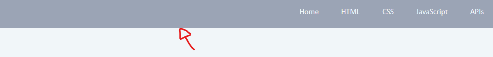

Reforge Journey Journal Entries

This text file marks the beginning of my journey to reacclimate and recommit to my previous passion and desire to undergo a career change in software engineering.

Purpose
The purpose of this project is to re-acclimate my acquired knowledge of coding from the UCLA Extension Bootcamp I enrolled and completed approximately one year ago. Navigating and even taking the first steps to change my career from a self employed photographer to being a software engineer has been very difficult due to the balancing of time allocation and finiancial obligations needed to survive in the modern age. This project will be an exercise in my commitment to reforge my coding skills so that I have the necessary tools to undergo my goal of becoming a professional software engineer. These Journal entries will be written informally as a way for me to organize my thoughts and allow others/potential future employers to explore my way of thinking and/or problem solving skills.

10/6/23 -2 AM

I will start off with committing this markdown file to my github and continue onward to create a webpage that will further organize and outline my journey to come.

Realizations - Need to reacclimate myself into getting into the flow of day-to-day coding again, including using git and github, creating commits, branches, etc.

I started with creating a repository with this journal entry file, a basic README, and the MIT license.

I think I should create a basic HTML and CSS file to start this project. I must also remember how to organize my respositories, and for that I'm going to revisit some of my earlier projects from my coding bootcamp. It seems like I used to have an assets folder that had CSS, JS, and other necessary subfolders so I'll apply that to my repository and create my boilerplate within. 

Alongside this boilerplate creation, I'll also use this as an opportunity to practice my branch creation and pull request/review habits. 

I should now look at my previous repos and see how I created boilerplate HTML and CSS files. Unsure If I want to incorporate javascript to this project just yet.

Finished going down a rabbit hole of reading articles and cross referencing my old work. I've re-familiarized the basics of repo structuring and also did a lot of research on industry standards. I've also re-opened the conversation of AI existing in today's software engineering case and have come to a few realizations. AI going forward may be an invaluable tool for efficiency. During my coding break, I've felt very nervous about how competent AI has become, especially in the software engineering world, but now have come to the realization that AI can also be a very useful tool for those that know how to integrate it to increase personal capabilities and efficiency in work. I should look to incorporate using AI more often in re-learning and also utilizing it for efficiency in my day-to-day work going forward. For now, I've added the boilerplate HTML file to the repo and will continue my journey tomorrow.

10/6/23 -11:40 PM

Tonight will be a short session but I really wanted to get my general idea outlined.

General Concept: Have a space where I can practice and display general concepts and practices. If not directly on this repo, I will include links to extraneous applications.

I'll retrace my steps in my bootcamp curriculum and create goals/segments to practice what I've previously learned. General objectives are as follows: 

HTML
CSS
JavaScript
APIs
Object Oriented Programming

For now I'll limit to those objectives as they are more front-end focused and ending with a refresher on object oriented programming will be a good segway to back-end application.

With just a little bit of an online refresher, a lot of HTML is coming back to me, and I remember that a lof of front end work came very natural to me. I managed to make a navbar pretty quickly and will look to create body content and link from navbar. Will not go for too much longer, but it's been a great refresher into some of the basic front end stuff!

Final few steps of the night result in the following, fixing the missing # symbols from above image and getting the base structure of the project underway.

Upon finishing my quick session for the night, I remember that my instructors also taught me about scrum meetings in the work environment. I'll also do my best to incorporate a short personal version of that for my sessions going into the future.

What I've Accomplished: 
Have refreshed basics of HTML and setup for CSS and javaScript.

What am I working on the next session: CSS styling, and HTML content for project goals/ideas.

10/10/23 - 8:20 PM

Gone for the weekend for a wedding but more inspired for this project than ever! Today's goal will be to see how far I can get with tinkering with my journey page. Some things I can work on are - 

Scope and Organization of project
Re-learning basic structures and code
Styling 
Mobile Adaptation

10/12/23 - 4:30 AM

I've been working at a broken pace the past few days, but for the past 6 hours, I've found myself in a very productive flow of revisiting styling through CSS and HTML. While not accomplishing much overall within this project, I've regained knowledge on how to do an astounding number of things I've forgotten since I've last committed time to code. Within the next day or two, I want to continue to brush up on my styling skills, but particularly finish the general aesthetic idea that I'll implement throughout the project and move on to create features with javascript.

From now on, I've also decided to prioritize my creative spurts and report on them afterwards rather than interrupting my flow for the sake of updating all of my steps within this journal.

10/13/23 - 6:30 AM

Started late, and also got very carried away tonight, but was able to accomplish and learn a lot even though not many apparent changes to the page have been made. I started off the night with just wanting to fill out the HTML and CSS section with a little bit more text content and maybe add just a little bit of styling, but ended up going down an inspirational rabbit hole of learning and making various stylistic adjustments that will be very valuable tools for the future.

After writing a bit more in the HTML and CSS sections, I wanted to fix an issue I ran into in which the floating sticky navigation bar I created would sort of incorrectly link the segments it was assigned to. When the links took me to the below segments, the floating navbar would cover the beginning of the sections because the links would navigate me so that the beginning of the list segments were the first things shown on top of the page as shown below.

Using the mix of research and AI, I utilized JavaScript for the first time in this project in order to create a function that offsets the targeted navigation links so that the navbar does not cut into the desired segments.

I then made some minor adjustments and added a conditional statement in order to fix a bug which made the home button in the navigation not function properly due to the addition of the new offset function I applied, and even though I was past my bedtime, I for some reason decided I would teach myself how to add a smooth scrolling effect to create a more modern feel when navigating through the page. 

The following progress sunk a total of four hours on reading/and tweaking functions and segments of functions I've found online and also tweaked using the help of AI. At the end of the night, I was able to not only create a smooth animation when navigating to different parts of the website, but also create a ramping function that created an additional subtle, but impactful effect in which the speed of the automatic scroll ramps up and slows down appropriately to create a even more polished and modern feel. Here is a screenshot of the ramping function I ended up with. 

10/14/23 - 3:13 AM

Today's session was mostly self exploration into styling standards and some subtleties of CSS and industry standards. Most of today's session consisted of small adjustments and working with how the project page scales with window resizing. The text elements now all behave in a consistent way when resizing the screen and stays where I want it to regardless of screen size. I was initially having issues with some text elements floating to areas that were not intended. For example, my text elements under the HTML section was floating up relative to where the section was anchored, my text would warp in odd ways in my Hero header segment, and various other small unintended reactions throughout. I think today's segment was mostly self educational on not only some of the issues I would definitely run into going forward, but also what industry standards and trends are with website design. 

I've realized that going forward, I can use a lot of my artistic background and training to benefit my website design significantly, and am very excited to embark on future self administered projects where I will have more curated content to work with to create a final product.